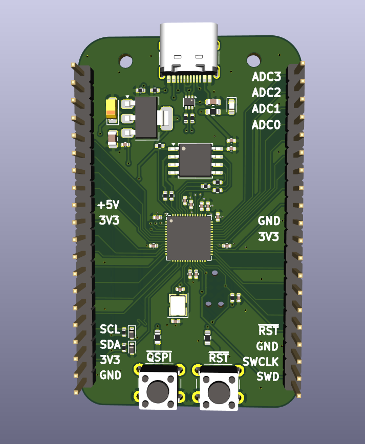
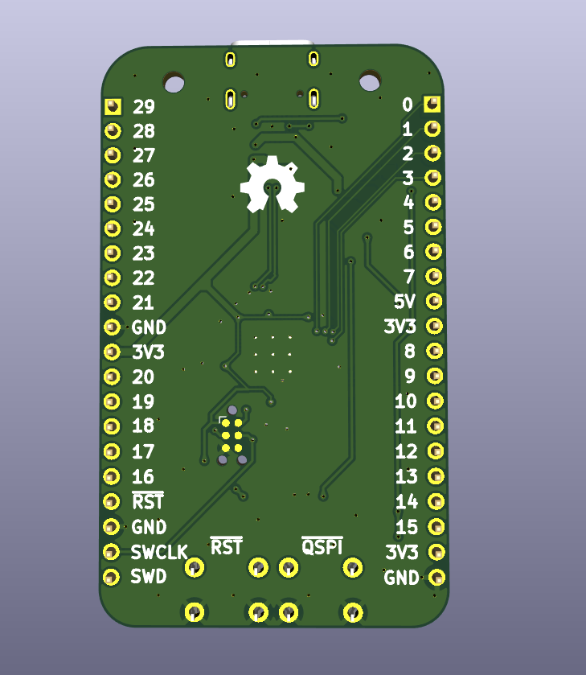

# Boku no Pico


 

## Introduction
This repository contains the design files and documentation for Boku no Pico (RP2040) development board, which is a variant of ARM Cortex-M0+ Raspberry Pi Pico. This board is tailored to enhance development for embedded systems enthusiasts by adding essential features and simplifying debugging and prototyping.

---

## Features
- Powered by the Raspberry Pi RP2040 microcontroller.
- Standard 4-pin SWD and I2C headers 
- USB-C connector for modern connectivity.
- Application of robustment enhancing techniques.
- Compact, breadboard-friendly form factor.

---

## Schematic and PCB Design
The hardware design was created using **KiCad**. The following files are included:
- **Schematic**: `RP2040_DevBoard.kicad_sch`
- **PCB layout**: `RP2040_DevBoard.kicad_pcb`

### Folder Structure
- `BOM/`: Bill of Materials for the components used.
- `PCB/`: Gerber files, Drill files and PaP files.
- `images/`: Board images in 3D but no rendered.

---

## How to Use
### Hardware Setup
1. Assembly the PCB by handing the files inside BOM and PCB folders to a PCB manufacturer such as PCBHero or JLCPCB.
2. Hand-solder manually the pin headers or the way you want (e.g. sockets, wires)
3. Use a 4-pin SWD debugger (e.g., J-Link or Picoprobe) or Arm connector tag for flashing firmware.

### Programming
- Use the official Raspberry Pi Pico SDK for development.
- Alternatively, program using MicroPython or CircuitPython.

---

## Getting Started
1. Clone this repository:
   ```bash
   git clone https://github.com/Pyisoe-Thame/boku_no_pico.git


